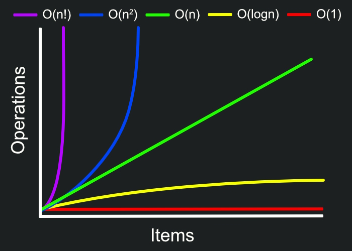

# Algoritmos de Ordenamiento

En este documento estan detalladas las caracteristicas de cada uno de los algoritmos de ordenamiento basicos, junto a una explicacion sencilla del funcionamiento de cada algoritmo. Cada algoritmo tiene un enlace a un articulo donde se encuentra una implementacion en distintos lenguajes incluyendo C++, junto a una explicacion mas detallada del mismo.

Algunos de los conceptos basicos sobre estos algoritmos son:

* **Iteracion:** Repeticion de un ciclo o proceso.

* **Complejidad de un algoritmo:** Medida de cuan eficiente es el algoritmo para resolver el problema. En otras palabras, es una medida de cuanto tiempo y espacio (memoria) requiere el algoritmo para producir una solucion. Cada algoritmo tiene una **complejidad en tiempo** (cuantas iteraciones realiza por cada elemento que se anade) y **complejidad en espacio** (cuanto espacio de memoria utiliza, por ejemplo, para guardar datos temporales).

 

   </img>

Mientras la complejidad del algoritmo se acerque mas a O(1), mas eficiente es.

 

* **Algoritmo estable:** Los algoritmos de ordenamiento estables aseguran que, en caso de haber 2 elementos iguales en la lista de *entrada*, despues del ordenamiento, los 2 elementos seguiran estando en el mismo orden en la lista de *salida*. Los algoritmos de ordenamiento no estables no garantizan esto.

**<u>Ejemplo:</u>**
Entrada: &ensp; &ensp; &ensp; **4A** 5 3 2 **4B** 1  
Salida estable: &ensp; &ensp; &ensp; &ensp; &nbsp; 1 2 3 **4A** **4B** 5  
Salida no estable: &ensp; &ensp; &nbsp; 1 2 3 **4B** **4A** 5

## [Bubble Sort](https://www.geeksforgeeks.org/bubble-sort/)

* **Complejidad de tiempo:**
    * Mejor caso: O(N)
    * Caso promedio: O(N^2^)
    * Peor caso: O(N^2^)
* **Espacio auxiliar:** O(1)

### Ventajas
* Facil de entender e implementar
* La unica memoria que utiliza es una variable temporal para hacer un intercambio de elementos
* Es estable.

### Desventajas:
* Muy ineficiente para listas de mas de 50 datos.
* Aun para listas pequenas, otros algoritmos tienden a ser mas eficientes.

### Funcionamiento
1. Empieza desde la izquierda de la lista y compara elementos adyacentes.
2. Si el elemento de la izquierda es mayor al de la derecha, se intercambian sus lugares.
3. Se realiza esto por cada elemento de la lista, de forma que al finalizar este proceso, el mayor elemento este a la derecha de la lista.
4. Se repite el proceso para encontrar el segundo mayor elemento, y asi sucesivamente.

## [Selection Sort](https://www.geeksforgeeks.org/selection-sort/)

* **Complejidad de tiempo:**
    * Mejor caso: O(N^2^)
    * Caso promedio: O(N^2^)
    * Peor caso: O(N^2^)
* **Espacio auxiliar:** O(1)

### Ventajas
* Facil de entender e implementar
* Util para listas de menos de 50 elementos.

### Desventajas
* No es eficiente para listas de mas de 50 elementos.
* No es estable.

### Funcionamiento
En este algoritmo, la lista se "divide" en una porcion ordenada y una no ordenada.

1. Busca el menor elemento de la porcion no ordenada, e intercambialo con el elemento en la primera posicion de la porcion ordenada.
2. Busca el menor elemento de la porcion no ordenada, e intercambialo con el elemento en la segunda posicion de la porcion ordenada.
3. Repite hasta que no exista ningun elemento en la porcion no ordenada.

## [Insertion Sort](https://www.geeksforgeeks.org/insertion-sort/)

* **Complejidad de tiempo:**
    * Mejor caso: O(N)
    * Caso promedio: O(N^2^)
    * Peor caso: O(N^2^)
* **Espacio auxiliar:** O(1)

### Ventajas
* Facil de entender e implementar.
* Es estable.
* Eficiente en listas parcialmente ordenadas.
* Util para listas de menos de 50 elementos.

### Desventajas
* No es eficiente para listas de mas de 50 elementos.

### Funcionamiento
Al igual que en selection sort, la lista se "divide" en una porcion ordenada y una no ordenada.

1. Se compara el primer y segundo elemento de la porcion no ordenada.
2. Se ordenan ambos elementos, y se colocan en la porcion ordenada.
3. Se toma el primer elemento de la porcion no ordenada, y se compara con los elementos de la porcion ordenada, para determinar donde debe ser insertado en dicha porcion, y se inserta donde corresponde.
4. Se repite el paso anterior hasta que no exista ningun elemento en la porcion no ordenada.

## [Quick Sort](https://www.geeksforgeeks.org/quick-sort/)

* **Complejidad de tiempo:**
    * Mejor caso: O(Nlog(N))
    * Caso promedio: O(Nlog(N))
    * Peor caso: O(N^2^)
* **Espacio auxiliar:**
    * Si se considera la memoria usada para llamadas de funciones: O(N)
    * Si no se considera: O(1)

### Ventajas
* Eficiente en listas con una gran cantidad de elementos.
* Poca cantidad de memoria para su funcionamiento.

### Desventajas
* Tiempo de complejidad del peor caso de O(N^2^), que ocurre cuando se elige un mal pivote. (Existen tecnicas para mitigar esto).
* No es la mejor eleccion para listas con pocos elementos.
* No es estable.

### Funcionamiento
Este es un algoritmo de "Divide y Venceras", lo cual quiere decir que divide la lista en pequenas sub-listas para luego procesar dichas sub-listas y finalmente obtener la lista completa ordenada. Por esta razon, es preferible ver su funcionamiento mediante un [video](https://www.youtube.com/watch?v=Vtckgz38QHs).

## [Merge Sort](https://www.geeksforgeeks.org/merge-sort/)

* **Complejidad de tiempo:**
    * Mejor caso: O(Nlog(N))
    * Caso promedio: O(Nlog(N))
    * Peor caso: O(Nlog(N))
* **Espacio auxiliar:** O(N)

### Ventajas
* Eficiente en listas con una gran cantidad de elementos.
* Misma complejidad de tiempo en el mejor y peor caso.
* Util para ordenar listas en donde no se tiene facil acceso a elementos no adyacentes, como listas enlazadas.

### Desventajas
* Requiere memoria adicional para guardar los elementos ordenados. Esto puede ser un problema en aplicaciones donde la memoria es escasa.
* No es muy buena eleccion para listas de pocos elementos. Una mejor opcion en este caso seria algoritmos como Insertion Sort o Selection Sort.

### Funcionamiento
Al igual que Quick Sort, este es un algoritmo de "Divide y Venceras", por lo que su funcionamiento se aprecia mejor mediante un [video](https://www.youtube.com/watch?v=3j0SWDX4AtU).

 

   Gracias por leer :)

   </img>

